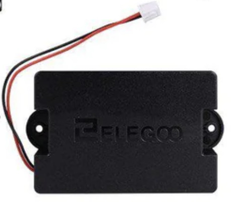
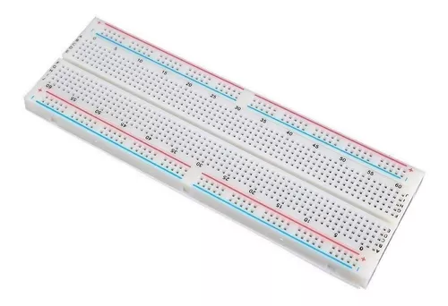

# Mobility management

We chose a vehicle chassis that was open and that would allow us to have both an Arduino board, a protoboard and a power source connected, which is why it was necessary to create two floors because otherwise the car would be very long and would exceed the measurements provided. We made two floors with simple Lego structures and made some small adaptations to place our DC motor, place our battery and 3D printed our own piece to be able to mount the pixy camera.  

We chose a 6V DC motor, which is one of the most common, but seeing that it did not have enough power, we worked with the “large gear-small gear” principle (to increase the speed of the output the driver gear is larger than the driven gear which is small (this will increase the speed of the output but decrease the “torque”)), which is what you will see in the diagram of the gear box and our propulsion, then with that engine, we simply place gears at the end of it, to double what is the angular speed and the linear speed that is generated on what are our rear wheels. That generates a little instability if we do it with a single gear, therefore we place two gears on each side, not to generate more power, but to generate more stability. 

We are working with two 5000 mA batteries that are commercially known as “powerbanks” precisely because they give a stable current through a USB cable that will not bend or break and will allow us to constantly power our vehicle. 

For the direction, we had to use a servomotor, it would have been ideal to place another 6V DC motor for this function, however, we would have had to work a lot with the voltage variations to have to make the change between forward and backward, that would require an additional integrated chip which would congest too much work for us on a physical level, therefore we placed a servomotor to work directly with the code which would allow us 90 degree rotations to the right and to the left and This is attached directly to a simple connection shaft and is what gives us mobility to the left and right of our vehicle. 

For the main controller, we are using an Arduino Rev3 Board, this is because as we mentioned in our introduction, we are high schoolers, and in our school we learned how to use this board. And also that the final proyect for our seniors in robotics is the "Smars" proyect, which is about constructing a autonomous robot (of course, this robot does nothing similar to the goals and purposes of this competition, but it inspire and gave motivation for this category). Not only that, but an Arduino board is easier to learn than other boards and controllers.

Here is our scheme of conduction and direction of our robot:

# Build

Now we will talk about, what our robot is made of: all the lego pieces, "ready to go"electrical components, and materials used in the final robot.

What is Terreneitor made of? Terreneitor is made essentially of:
- Pieces and lego parts from diverse lego sets we found in our robotics laboratory
- While also using "ready to go" electrical components  
- And our own parts and materials like personalized 3D printed models, silicone, tape and zip ties
- Also, the main controller of our robot is an Arduino board

In the chart below titled "THE LEGO PIECES OUR ROBOT USES ARE:", you will find:
1) First, the amount of that especific piece we used on the robot
2) Second, the color of that lego piece
3) Third, the code of that lego piece

|THE LEGO PIECES OUR ROBOT USES ARE:|                             
|-----------------------------|
|6x Yellow 4265c|
|10x Gray 3713|
|33x Black 2780|
|1x Red 6538c|
|1x Gray 60483|
|2x White x346| 
|2x Red 44809|
|2x Black 32270|
|1x Blue 32523|
|1x Gray 32523|
|4x Gray 32073|
|1x Black 33299|
|4x Gray 32140|
|1x Gray 44294|
|2x Black 3707|
|2x Gray 48989|
|4x Dark gray 3648|
|4x White 40490|
|5x Gray 40490|
|6x Gray 64179|
|4x Grey 56908|
|4x Black 41897|

You can see all of the lego pieces we used, for a better comprehension, more clearly and neatly in this diagram:

(this diagram is made by us using the official lego _BrickLink_ app)

Here is a step-by-step guide construction of the lego structure of our robot:

(we made this instruction guide using the _BrickLink_ app)

In the chart below titled "THE "READY TO GO" ELECTRICAL COMPONENTS OUR ROBOT USES ARE:", you will find:
1) First, the amount of that especific piece we used on the robot
2) Second, the name of that "ready to go" electrical piece/component

|THE "READY TO GO" ELECTRICAL COMPONENTS OUR ROBOT USES ARE:|Photo of each:|                                                  
|-----------------------------------------------------|--------------|
|1x MicroServo 9g (SG90)||
|1x Yellow 9V Geared Dc Motor| |
|1x Gray 6V Dc Motor| |
|1x Pixycam 2.1||
|2x Ultrasonic sensors||
|A lot of Arduino cables| |
|2x Bateries|  |
|1x Arduino Uno Rev3 Board||
|1x Protoboard MB-102 830 pins||

Apart from lego pieces and "ready to go" electrical components, we also used ordinary and our own materials, components and pieces like:

- our own 3D printed models (which you can find in this folder the files, and below the explanation)
- ordinary adhesive materials to join things or make them stronger like:
  - silicone
  - blue/black tape
  - zip ties

|OTHER MATERIALS OUR ROBOT USES ARE:|Photo of each:|                                                  
|-----------------------------------------------------|--------------|
|3D printed models||
|silicone| |
|black/blue tape|  |
|zip ties||

## Why did we chose all of these previous materials?

We chose all of these previous materials, components and pieces in our robot because is what we found in our robotics laboratory and school and is also what we are being taught.

Absolutely everything (the diverse lego pieces, the "ready to go" electrical components, and more) were also bought here in our country, Venezuela, except for the pixycam which was imported from abroad.

## Note:

- Mostly eveything we just mentioned is part of our final robot, but for the previous attempts and prototypes we used the same or almost the same materials, pieces, parts and components.

# Models

Now, we will talk about all the information regarding our 3D printed models, designed and printed by us. 

# 3D Scanner

Its important to mention that we also borrowed a 3D scanner to print some models. This is because in our robotics laboratory we needed to modify some lego pieces, or didn't have enough of them, so we decided to print our own lego pieces.

 

## Adapter for the wheels

This model is an adapter so we can join together the dc motor and the lego stick. The model has 2 sides: the first one being a cross so the lego stick fits there perfectly and the second one being a line where the dc motor fits. This 3D printed model is an essential part of our final robot's wheel mechanism, since thanks to this model it works.

⇩ ( The blue and yellow parts you see next to the wheels are the adapters ) ⇩
                                                                     

 

### (you can find the 3D model stl document in this folder)

## Support for pixy with adapter for lego

This model counts with two pieces which support the pixy like a case, it also counts with two holes at the ends so it can be adapted to the lego pieces which our robot is made with.

 

### (you can find the 3D model stl document in this folder)

## Blue piece

This model is a piece that functions to stop the dc motor from moving so it has a better performance. This model what 4 cm x 2 cm so it would in the space below the robot in the first prototype. 

 
 

### (you can find the 3D model stl document in this folder)

## Green and red obstacles

This model counts with two pieces: the first one being red and the second one being green. This pieces help us practice for the second round (obstacle challenge).

 
 

### (you can find the 3D model stl document in this folder)

